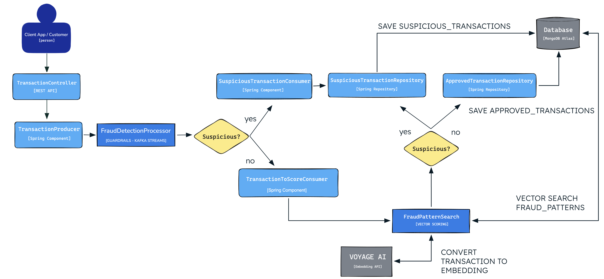

# Fraud Detection


Real-time fraud detection pipeline that scores card transactions using Kafka Streams, behavioral embeddings, and rule-based guardrails — without training a custom model.

## Slides
https://mdb.link/devnexus/fraud-detection-presentation

## Tech Stack

- Java 21
- Spring Boot 4
- Kafka Streams
- MongoDB 
- Voyage AI *(embedding generation)*

## Kafka Topics

| Topic | Description |
|-------|-------------|
| `transactions` | Receives all incoming transactions |
 | `transactions-suspicious` | Blocked transactions (fraud detected by rules) |
| `transactions-to-score` | Approved transactions (ready for embedding scoring) |
| `transactions-dlq` | Dead Letter Queue for malformed messages (e.g., invalid JSON) |

## How It Works



1. A transaction is sent via REST API to `transactions` topic
2. Kafka Streams processes and groups by card number
3. Rules evaluate: Impossible Travel, Velocity Check
4. **Blocked** → `transactions-suspicious` (fraud detected)
5. **Approved** → `transactions-to-score` (ready for scoring)
6. Malformed messages → `transactions-dlq`

## Fraud Rules

| Rule | Description | Example |
|------|-------------|---------|
| `IMPOSSIBLE_TRAVEL` | Same card used in distant locations in short time | Sao Paulo → New York in 5 minutes |
| `VELOCITY_CHECK` | Too many transactions in a time window | 4+ transactions in 1 minute |

## Running

### Prerequisites

- Docker & Docker Compose
- Java 21
- [MongoDB Atlas](https://www.mongodb.com/atlas) cluster with **Vector Search** enabled
- [Voyage AI](https://www.voyageai.com) API key

---

### 1. Start Kafka

```bash
docker compose up -d
```

This starts Kafka, creates all required topics automatically, and spins up **Kafka UI** at `http://localhost:8080`.

---

### 2. Seed the MongoDB collection

The seed scripts populate the `fraud_patterns` collection with labeled fraud and non-fraud transaction patterns used for vector similarity search.

```bash
mongosh "$MONGODB_URI" --file scripts/seed-fraud-patterns-100.mongosh
mongosh "$MONGODB_URI" --file scripts/seed-nonfraud-patterns-100.mongosh
```

> After running, the collection `fraud-detection.fraud_patterns` will have 200 documents ready for vector search.

---

### 3. Create the Vector Search Index

Run the following command to create the Atlas Vector Search index required for fraud pattern scoring:

```bash
mongosh "$MONGODB_URI" --eval '
db.getSiblingDB("fraud-detection").fraud_patterns.createSearchIndex(
  "fraud_patterns_vector_index",
  "vectorSearch",
  {
    fields: [
      {
        type: "vector",
        path: "embedding",
        numDimensions: 1024,
        similarity: "cosine"
      }
    ]
  }
)'
```

> The index may take a few minutes to become active on Atlas. You can check its status in the **Atlas UI → Search Indexes** tab.

---

### 4. Set environment variables

```bash
export MONGODB_URI="mongodb+srv://<user>:<password>@<cluster>.mongodb.net/?appName=devrel-tutorial-java-frauddetection"
export VOYAGEAI_API_KEY="your-voyage-api-key"
```

---

### 5. Run the application

```bash
./mvnw spring-boot:run
```

The API will be available at `http://localhost:8081`.

> On startup, the application automatically detects all documents in `fraud_patterns` that have no embedding and backfills them by calling Voyage AI. All 200 seeded documents will be embedded and updated in MongoDB before the app is fully ready.

---

### 6. Send a transaction

```bash
curl -X POST http://localhost:8081/api/transactions \
  -H "Content-Type: application/json" \
  -d '{
    "transactionId": "TXN-001",
    "userId": "USR-123",
    "merchant": "Starbucks",
    "city": "Sao Paulo",
    "transactionAmount": 25.50,
    "transactionTime": "2025-01-15T10:30:00Z",
    "cardNumber": "4444-5555-6666-7777",
    "latitude": -23.5489,
    "longitude": -46.6388
  }'
```

See `src/main/resources/http/fraud-detection.http` for more example requests including impossible travel, velocity check, and vector search scenarios.

---

